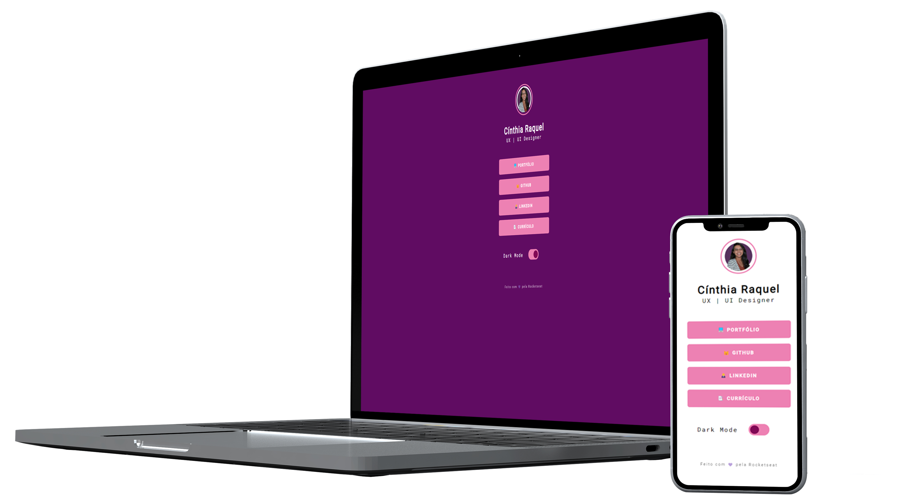

# Maratona Explorer 2.0

> Página de links 

## 📑 Sobre o projeto

Projeto desenvolvido durante a Segunda Maratona Explorer da Rockeseat.
Você pode acessar o projeto no link: https://cinth010.github.io/cinthia-links/

## 👩‍💻Desenvolvimento

Para esse projeto foi utlizado a HTML, CSS e Javascript

## 📝 Licença

Esse projeto está sob licença. Veja o arquivo [LICENÇA](LICENSE.md) para mais detalhes.

[⬆ Voltar ao topo](#nome-do-projeto) 
